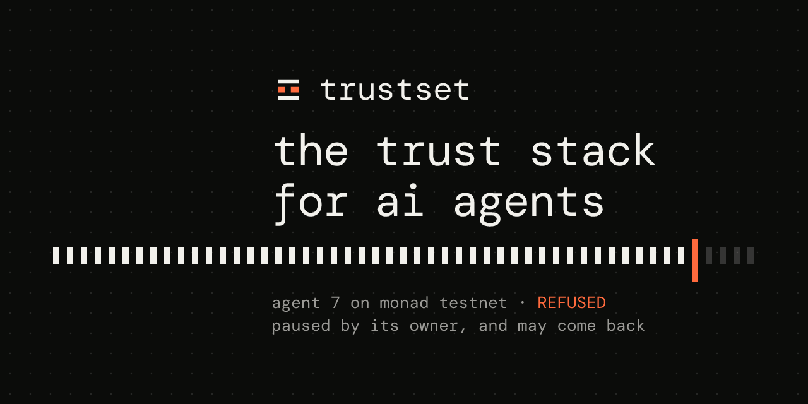

<p align="center">
  <picture>
    <source media="(prefers-color-scheme: dark)" srcset="brand/assets/social.png">
    <source media="(prefers-color-scheme: light)" srcset="brand/assets/social-light.png">
    
  </picture>
</p>

# trustset

**the trust stack for ai agents.** eight on-chain primitives, each an immutable contract with no admin, on monad.

an agent with a key can trade, pay and sign for as long as it runs. trustset gives the person who
owns it one place to say stop, and gives every app the agent talks to one call to check before it
acts. pausing is reversible, stopping for good is not, and both land in the next block.

built for monad metropolis, track 04: trust, identity and ai infrastructure.

- live: **https://trustset.silknodes.io**
- chain: monad testnet, chain id **10143**
- switch: [`0x54D8211233Cc65b62C594cBAb900930dd37ED3b8`](https://testnet.monadexplorer.com/address/0x54D8211233Cc65b62C594cBAb900930dd37ED3b8)
- package: [`@trustset/check`](https://www.npmjs.com/package/@trustset/check)
- who would adopt this and why: [`ADOPTION.md`](ADOPTION.md)
- what it does not protect against: [`AUDIT.md`](AUDIT.md)
- built by [silk nodes](https://silknodes.io) · mit licensed

---

## what trustset does

an agent key is a standing authorisation. nothing about it expires, nothing about it can be
withdrawn, and the only way to take it back today is to drain the wallet it holds or hope every
venue it talks to happens to notice. trustset is the set of primitives that makes that
authorisation revocable, recoverable and accountable. eight layers, each its own contract:

| layer | what it gives you | contract |
| --- | --- | --- |
| identity | an agent id, a human label, its cold key, and an erc-8004 identity that points back at the switch | `KillSwitch`, `AgentLabels` |
| the switch | pause or stop from the cold key, and every app that checks refuses it from the next block | `KillSwitch` |
| panic button | a passkey on a phone that can pause and nothing else, verified on chain by the p256 precompile | `KillSwitch` |
| guardians | people you chose can pause by vote, and recover a lost cold key through a delay you can cancel | `KillSwitch` |
| limits | an end date, or a heartbeat it has to keep. when either lapses it stops being trusted with nobody awake | `KillSwitch` |
| past signatures | `isTrustedAt(id, at)`, so a venue judges an order by when it was signed rather than by now | `KillSwitch` |
| human proof | a passkey assertion recorded against an action, so anyone can later ask whether a person was present | `HumanTouch` |
| refunds | an escrow with a window, and a refund anybody may send that pays the payer named in storage | `RefundRail` |

no server of ours sits in any of those paths. every contract is immutable, has no admin, and holds
no funds except the escrow, which only ever moves money back to whoever put it in. there is no key
anybody could subpoena and no switch we could flip. a stack of primitives an app picks from, not a
platform an app joins.

## check an agent

```bash
npx @trustset/check 7
```

```
switch 0x54D8211233Cc65b62C594cBAb900930dd37ED3b8 on https://testnet-rpc.monad.xyz

agent 7  TRUSTED
  why        trusted, may act
  ends       none
  next beat  2026-09-21 08:02 utc
```

in an app:

```bash
npm i @trustset/check ethers
```

```js
import { client } from "@trustset/check";

const trustset = client();            // monad testnet, the address above, by default

if (await trustset.isTrusted(7)) {
  await placeTheTrade();
}
```

that is the whole integration. one view call, no keys, no accounts, nothing to sync. the same call
works from two places and they are not equally strong. inside your own agent it is obedience you
chose, and it does not save you from an agent that has been taken over and rewritten. inside a
venue's own function it is compulsory, and nothing upstream can skip it. `sdk/README.md` is honest
about which you are getting.

in solidity, inside the function that acts:

```solidity
if (!killSwitch.isTrusted(agentId)) revert AgentNotTrusted(agentId);
```

## features

- **four independent ways to stop**, two of which need nobody to send a transaction
- **passkey panic button** over monad's native p256 precompile, verified on chain, proven on testnet
- **guardian recovery** with a threshold and a cancellable delay, so a lost key is not a lost agent
- **history by timestamp**, so an app can judge an order by what was true when it was signed
- **erc-8004 both directions**, so an app that knows an agent only by its identity token can still
  ask whether it has been switched off
- **refund rail** for x402 style payments, with a permissionless refund anybody can trigger
- **an explorer** derived from logs rather than from anything we assert
- **141 tests**, including 128,000 fuzzed calls per run asserting eleven invariants

## architecture

```
          owner's wallet            a phone with a passkey
                │                            │
                │ pause / stop / limit       │ pause only, gasless
                ▼                            ▼
        ┌───────────────────────────────────────────┐
        │  KillSwitch.sol        monad testnet      │
        │  immutable · no admin · holds no funds    │
        │  status · expiry · heartbeat · guardians  │
        └───────────────────────────────────────────┘
             ▲            ▲                   ▲
  isTrusted()│            │isTrusted()        │ getMetadata("trustset")
             │            │                   │
      the agent        a venue          ERC-8004 Identity
      (obedience)    (compulsory)        0x8004A8…BD9e
                          │
                          ▼
                  ┌───────────────┐
                  │ RefundRail    │  escrow, refundable once the window closes
                  └───────────────┘
                          │ logs
                          ▼
                  indexer → postgres → web (explorer, demo, panic, passkey)
```

the indexer only ever reads logs, so the explorer cannot show anything the chain did not say. the
keeper only ever calls `refund(id)`, which pays the payer named in storage and nobody else.

## the four ways an agent stops

two of them need somebody to send a transaction and two do not.

| | who | reversible |
| --- | --- | --- |
| pause | the cold key, or a nominated passkey | yes |
| stop for good | the cold key | no, revoked is terminal |
| the end date passes | nobody, it is a timestamp | only by moving the date |
| a heartbeat is missed | nobody, the agent stopped calling `beat()` | yes, by beating again |

the last two matter more than they look. an agent that is compromised, wedged or simply forgotten
goes quiet on its own, without anybody noticing in time to act. `isTrusted` already accounts for
all four, so checking it is enough; `why()` returns the word a person will read in a log later.

## pausing with a fingerprint

the case this exists for: something is wrong and the wallet is on a laptop in another room. a phone
and a fingerprint pause the agent instead.

the owner nominates a passkey from `/passkey`. the private half is created inside the device and
never leaves it; what goes on chain is the public p256 point and the sha256 of the site it is bound
to. afterwards anyone holding that device can pause the agent from `/panic` with no wallet, no seed
phrase and no gas: a relayer carries the assertion and pays, which is safe because the assertion is
the authority and a relayer can forge none of it.

the contract verifies the signature itself through the p256 precompile at `0x0100`, requires the
device to have verified a person rather than just felt a touch, and spends a nonce so an assertion
is good exactly once. a passkey can pause and nothing else: it cannot resume, end, relimit or
rekey. so a stolen phone costs its owner an interruption.

proved on testnet: [`0x391f1ad4…237f34b6`](https://testnet.monadexplorer.com/tx/0x391f1ad46bece914fd739e6e06fc4c1ce17a3f9bddd7f26906b26761237f34b6)
paused agent 7 from a phone, with `keccak("paused with a passkey")` as the recorded reason.

## losing the cold key

guardians the owner named can vote to move an agent to a new key. the vote needs a threshold, then
waits out a delay during which the real cold key can cancel it with one call. so guardians cannot
take an agent quietly, and the owner does not lose one to a lost key.

## reading the past

`isTrustedAt(id, timestamp)` answers whether an agent was trusted at a moment, not just now. that
is what lets an app judge an order it received an hour ago by what was true when it was signed
rather than by what is true when it gets around to filling it. `verifySigned()` in the sdk does the
whole thing: recover the signer, find its agent, ask the switch about that moment.

## erc-8004

the trustless agents registries are live on monad testnet. the live agent holds identity token
**1873**, and its registration points back at this switch. the registry has no revocation primitive
of its own, only an `active` flag in an off-chain json, which is the gap this fills.

the pointer is read in both directions, and the second one is the useful one. an app that knows an
agent only by its 8004 identity can ask whether that agent has been switched off, without knowing
trustset exists beforehand and without asking any server of ours:

```bash
npx @trustset/check --erc8004 1873
```

```
erc-8004 agent 1873 points at trustset agent 7 on chain 10143.

agent 7  REFUSED
  why        paused, paused by its owner, and may come back
```

two view calls against two public contracts. the pointer is the token owner's claim, so it is
checked for the chain and the switch it names rather than believed. what cannot be checked is the
reverse binding, and `AUDIT.md` says so plainly.

## contracts

| contract | holds funds | what it does |
| --- | --- | --- |
| `KillSwitch` | no | the whole product. per agent: hot key, cold key with a change delay, guardians, expiry, heartbeat, passkey, status with history. `isTrustedAt(id, at)` for judging old signatures |
| `AgentLabels` | no | a human name for an agent id, set by its cold key |
| `HumanTouch` | no | webauthn assertions as general proof a person was present, beyond the panic button |
| `RefundRail` | escrow | authorise and capture for x402 style payments, so a stopped agent's in-flight money can come back |
| `OperatorRegistry` | operator bonds | validators opting in as trust operators, bls aggregate statements, slashing on a contradiction. the original direction, kept because it works and the bls library is tested against monad's own precompiles |
| `libraries/WebAuthn` | no | authenticator data, client data and low-s normalisation over the p256 precompile at `0x0100` |
| `libraries/BLS` | no | rfc 9380 hash to g2, g1 and g2 add, pairing check |

deployed addresses are in [`deployments/monad-testnet.json`](deployments/monad-testnet.json).

## the refund keeper

the rail is permissionless: once a payment's window closes, `refund(id)` may be called by anybody,
and the money goes to the payer rather than to whoever called it. that is what makes it safe for a
stranger to press, and it is also why nothing happens until a stranger does. a deadline passing
moves no money on its own.

`keeper/` sends that transaction. it watches for payments whose window has closed while they are
still open and calls refund. it is a convenience, never an authority: every payment it touches would
have been refundable without it, the payer can always call refund themselves, and if the keeper is
off the only thing lost is promptness.

the key it holds can do exactly one thing. `refund(id)` takes no argument but an id and pays the
payer named in storage, so the keeper cannot direct money anywhere, cannot settle, cannot pay, and
cannot touch a payment whose window is still open. the worst a stolen keeper key can do is return
other people's money on time and pay the gas for it.

```bash
KEEPER_KEY=0x... node keeper/index.mjs
```

## run locally

### prerequisites

- [foundry](https://getfoundry.sh) for the contracts
- node 18 or newer for the sdk, agent, keeper, indexer and site
- postgres, only if you want the explorer's indexer

### the contracts

```bash
forge build
forge test                  # 141 passing, 1 skipped, across 10 suites
```

forge-std is vendored under `lib/`, so a clone builds with no submodule step.

### the whole thing on anvil

```bash
scripts/demo.sh             # anvil, contracts, a venue, and a browser demo on 127.0.0.1:8787
```

### the site

```bash
cd web && npm install && npm run dev
```

### the sdk

```bash
cd sdk && npm install && node cli.mjs 7
```

reads monad testnet. no keys, no config, no writes.

### environment

every service reads its configuration from the environment and none of it is committed.
`.env.example` lists the keys with empty values. nothing falls back to a plausible default: a
missing variable is logged by name and the service degrades visibly rather than pretending.

## monad specifics

- monad charges the **gas limit, not the gas used**, so every transaction the agent and the site
  send estimates first and pads, rather than guessing high
- `eth_getLogs` is capped at 100 blocks and 15 requests per second per address; the indexer is
  built around both
- execution is asynchronous, so the `finalized` tag can name a block that has not executed. reads
  go to finalised minus four
- `isTrustedAt` reads history by timestamp and never `latest`, because `latest` is speculative
- one struct per agent, so a status read is one storage page under mip-8
- the p256 precompile at `0x0100` is present on both testnet and mainnet. `eth_getCode` returns
  empty for a precompile even when it works, so it is a useless availability test
- the staking precompile at `0x1000` has no code on testnet, which is why `OperatorRegistry` is not
  part of the deployed path

## what the tests actually claim

unit tests prove each door works and refuses the obvious wrong caller. they cannot prove that no
ORDER of those calls reaches a state the design forbids, which for a switch is the only question
that matters. `test/Invariants.t.sol` puts the contract under 128,000 fuzzed calls per run in
whatever order the fuzzer likes, and asserts eleven properties across them, including:

- revoked and rotated are terminal, and `isTrustedAt` still says so about every later moment
- the cold key moves through exactly two doors, both timelocked, and through nothing else
- nothing skips its delay: not a key handover, not a recovery, not an escalation
- guardians cannot pause below their threshold of DISTINCT votes
- only a pause the guardians made can be escalated to revoked
- trusted means all four ways of stopping are clear, not just the status
- the history only grows, and never backwards in time

each of those was checked by deleting the guard it depends on from `KillSwitch.sol` and confirming
the suite goes red. three of them did not, at first, and the suite was wrong rather than the
contract: it proved who may move a thing and never that they waited. `AUDIT.md` records what the
invariants still do not reach.

## who would adopt this

a kill switch is worth nothing on its own. it is worth something when the places
an agent spends money check it, which makes adoption the product risk rather than
a go-to-market afterthought.

[`ADOPTION.md`](ADOPTION.md) names the specific segments, in the order they
actually carry the risk: agent launchpads including monad's own Agent Hub, the
orderbook venues already taking agent flow, anything charging agents per call,
agent frameworks, and teams running their own treasury agents. for each one it
says what the integration is and why building it in-house is worse.

the short version of why not roll your own: a switch you control is a switch your
users have to trust you with, and a platform cannot certify neutrality about
itself. everything else, the p256 verification, the cancellable guardian delay,
the history by timestamp, is just work you would rather not do twice.

it also names who will **not** adopt, and what is true today, which is that
there are no external integrations yet.

## honest limits

[`AUDIT.md`](AUDIT.md) is the part worth reading if you are deciding whether to trust this. it says
what each piece does not protect against, including the one that matters most: **a switch only binds
an agent that checks it, or a venue that checks it for them.** an agent that never asks is not
stopped by anything here.

other limits it records:

- the erc-8004 pointer can be checked in one direction only
- `isTrustedAt` checks expiry against the agent's current end date, because only the current one is
  stored, so moving the end date changes the answer about the past
- the heartbeat is not part of the historical answer at all: liveness is a fact about now, and no
  record of past beats is kept
- this is testnet, and unaudited

## project layout

```
src/            the contracts
  libraries/    WebAuthn over the p256 precompile, BLS over monad's pairing precompiles
test/           141 unit tests plus the invariant suite and its handler
script/         forge deployment scripts
deployments/    the deployed addresses, per chain
sdk/            @trustset/check, the npm package apps integrate
agent/          a real agent on testnet: checks the switch, trades, stops when told
keeper/         the refund keeper, plus its systemd unit
indexer/        walks logs into postgres around monad's 100 block cap
web/            next.js site: landing, explorer, /demo, /panic, /passkey
brand/          the mark, the palette, and make.mjs to regenerate every asset
scripts/        demo.sh, deploy.sh, site-audit.js
```

## tech stack

- **contracts**: solidity 0.8.28, foundry, via-ir, evm version osaka
- **sdk**: node 18+, ethers v6, zero config
- **web**: next.js 16, react, tailwind 4, motion
- **indexer**: node, postgres
- **chain**: monad testnet, p256 and bls precompiles, erc-8004

## brand

the mark is a face: a top bar, two eyes and a bottom bar, with the eyes orange at rest. the tile
takes the text colour and the bars take the ground colour, so it inverts against whatever page it
sits on. [`brand/BRAND.md`](brand/BRAND.md) has the palette with measured contrast ratios, the type
rules, and the one place orange must not be used. every asset regenerates with `node brand/make.mjs`.

## contributing

issues and pull requests are welcome. if you are changing a contract, add the invariant that would
have caught the bug, then delete the guard and confirm the suite goes red. a test that passes
against a broken contract is worse than no test.

## license

mit. see [`LICENSE`](LICENSE).

## acknowledgments

- the monad team for the p256 precompile, without which the panic button would need a server
- the erc-8004 trustless agents registries, live on monad testnet
- foundry, for the invariant fuzzer that found three places this was wrong
